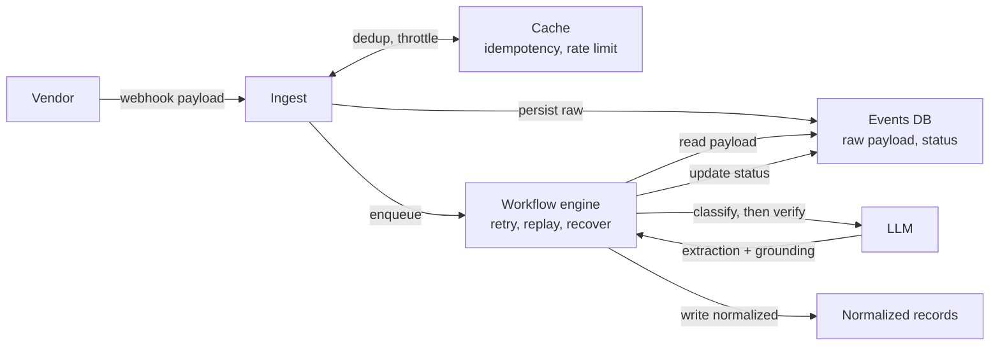
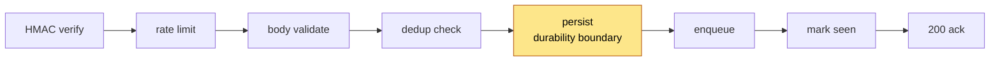

# Glacis Webhook Service

AI-powered webhook ingestion for supply-chain events. Accepts arbitrary
JSON from logistics and financial vendors, verifies HMAC signatures,
classifies and normalizes via an LLM under Temporal-orchestrated retries,
persists results, and surfaces flagged extractions to a human review
queue.

**Stack:** Django 5.2 LTS + DRF · PostgreSQL · Redis · Temporal ·
OpenRouter LLM · OpenTelemetry · Standard Webhooks (HMAC) ·
django-ratelimit · k6.

## Architecture

A vendor posts arbitrary JSON. We ack as soon as the raw payload is
durably stored; classification, normalization, and the final record
write happen asynchronously.



## Hot path: `POST /webhook`



## Quick Start

Set your OpenRouter API key in `.env`, then run one script:

```bash
cp .env.example .env
# Edit .env: set OPENROUTER_API_KEY to a real key.

./scripts/demo.sh
```

`demo.sh` brings up the stack, seeds a demo vendor credential and a
Django superuser, posts every sample in `samples/` to `/webhook`, and
prints a status summary plus URLs for the admin and Temporal UIs.

After the demo:

```bash
./scripts/send_sample.py shipment_fedex          # post a single sample
docker compose down -v                            # tear down
```

Browse processed events and triage flagged extractions in the
admin UI; the Temporal Web UI shows workflow history and lets you
inspect retries.

URLs:

- API · http://localhost:8000/health
- Admin (review queue) · http://localhost:8000/admin/  — login `admin` / `admin`
- Temporal Web UI · http://localhost:8233

## API

| Endpoint | Notes |
|---|---|
| `POST /webhook` | Standard-Webhooks-signed body ≤ 1 MB. Required headers: `webhook-id`, `webhook-timestamp`, `webhook-signature`, `x-vendor-id`. Returns `{status: "accepted" \| "already_received", idempotency_key}`. Status codes: 200 / 401 / 413 / 422 / 429 / 503. |
| `GET /health` | DB hard-required (503), Redis/Temporal soft (200 degraded). |
| `GET /health/live` | Liveness — process-up. |
| `/admin/` | Auth-walled review queue UI for flagged extractions. |

### Response conventions

- **Success** (`200`): JSON body `{status, idempotency_key}`. Replays
  additionally carry `Idempotent-Replayed: true` so SDKs can detect a
  dedup'd retry from the header alone.
- **Errors** (`4xx`/`5xx`): RFC 7807 Problem Details
  (`application/problem+json`) with stable `type` URIs (`/errors/...`),
  e.g. `/errors/rate-limited`, `/errors/payload-too-large`,
  `/errors/unauthenticated`, `/errors/service-unavailable`. Rate-limit
  and backpressure responses include both `Retry-After` and a
  `retry_after_seconds` body field.
- **`Cache-Control: no-store`** on every response — webhook replies
  must never be cached by an LB / WAF / CDN, regardless of status.

### Idempotency

Vendors are expected to send a per-event `webhook-id` header (Standard
Webhooks contract). That ID is the dedup token. The `POST /webhook`
flow checks for retries across three layers:

1. **Redis fast-path** — vendor-namespaced cache lookup on
   `(vendor_id, webhook-id)`. Two vendors emitting the same
   `webhook-id` never collide because the key is namespaced.
2. **DB unique constraint** on the canonical idempotency key —
   authoritative, survives Redis loss or expiry.
3. **Workflow-engine `workflow_id` collision** — duplicate
   `start_workflow` raises `WorkflowAlreadyStarted`, which the view
   maps to `200 already_received`.

A retry returns `200 {status: "already_received", idempotency_key}`
with the original key, so the vendor sees a stable response.

## Architectural decisions

### Authentication

HMAC over the request body, per-vendor secret stored in `VendorCredential`.
The HMAC is the authoritative identity; `X-Vendor-ID` is a hint to look up
which secret to verify against. A wrong vendor claim resolves to the wrong
secret, the signature mismatches, the request is 401'd. Same opaque error
message for unknown-vendor and bad-signature so callers can't distinguish
"vendor exists" from "wrong key".

The verified `vendor_id` flows through to `WebhookEvent.source_vendor` and
namespaces every dedup key, so cross-vendor collisions are impossible by
construction.

mTLS or per-vendor API key adapters drop in behind the same
`VendorCredential`-shaped seam without rewiring the `source_vendor`
plumbing.

### Two-layer rate limiting

The first layer runs *before* authentication and buckets by client
IP, so a flood of forged signatures gets 429'd without burning the
HMAC verify and DB lookup cost per request. The second layer runs
*after* authentication and buckets by vendor identity, providing
fair-share between vendors and shedding misbehaving ones.

The pre-auth layer is not a substitute for an LB or WAF — those
remain the real DDoS layer in production. Implementation lives in
`webhooks/middleware.py` and `webhooks/permissions.py`; both layers
are configurable via `PRE_AUTH_IP_RATE_LIMIT` and `DEFAULT_RATE_LIMIT`
in `.env`.

### Recovering stuck events

A row can get stranded in two ways: the DB insert succeeded but
enqueueing the workflow failed, or the workflow started but died
before reaching a terminal state (e.g. the LLM retry loop hit the
run-timeout). A scheduled background job periodically scans for both
conditions and re-enqueues the work, so a vendor who got a 200 from
us is guaranteed eventual processing.

The job runs on a Temporal Schedule, which gives us leader election
across replicas and a UI to pause / inspect / manually trigger it.
Implementation lives in `workflows/definitions.py`
(`SweepStuckEventsWorkflow`) and `workflows/schedules.py`.

### Observability

We emit OpenTelemetry traces that propagate across the API request,
the workflow, and the activities, so a single trace links the
`POST /webhook` call to the LLM call and DB writes that processed it.
The `workflow_id` (= `idempotency_key`) is the correlation key.

Disabled by default; set `OTEL_EXPORTER_OTLP_ENDPOINT` to any
OTLP-compatible backend (Tempo, Jaeger, Honeycomb) to enable.
Implementation lives in `project/otel.py`.

### Bridging the sync API and the async workflow engine

The Temporal Python SDK is async-only, but our Django ingest view is
sync. A single long-lived event loop runs in a daemon thread per
worker process, owns the gRPC client, and accepts coroutines from
sync callers — so we get one persistent connection without forcing
the whole HTTP stack to async.

Backpressure, fork-safety, and graceful shutdown on SIGTERM are
handled there. Implementation lives in `project/temporal_bridge.py`.

### Three layers of dedup, vendor-namespaced

- **Redis cache** — fast-path duplicate rejection, 7-day TTL.
- **DB unique constraint** on `WebhookEvent.idempotency_key` —
  authoritative.
- **Temporal `workflow_id` = idempotency_key** — third defense; duplicate
  `start_workflow` raises `WorkflowAlreadyStarted`, treated as benign.

### Hot-path ordering and the durability boundary

Per-request order is **Redis-check → DB → Temporal → Redis-mark**. The
DB insert is the **durability boundary**. After it succeeds, the event
is persisted; if `start_workflow` then fails the row sits at RECEIVED
and the sweeper re-issues it. Redis is best-effort. A vendor who gets
a 200 from us is guaranteed eventual processing even if downstream
blips, including the case where the workflow run itself was terminated
by Temporal's `run_timeout`.

### Two-pass extraction with a verifier

Each event runs through two LLM passes: a classifier that extracts
the structured record, and a verifier that confirms every extracted
field is grounded in the source payload. The verifier shares
normalization rules with the classifier (status mapping, vendor-id
derivation, ISO timestamps, numeric equality) so legitimate
transformations aren't flagged as hallucinations.

When the verifier disagrees, the row goes to a human review queue
with the verifier's findings preserved and no FK record is written.
A row also lands in review for one other reason, surfaced as a
distinct value in the admin's `reason` column:

- **`ungrounded`** — verifier flagged extracted values it couldn't
  locate in the source.
- **`schema_rejected`** — classifier returned JSON in the wrong
  shape (including currencies that aren't valid ISO 4217); raw
  output preserved for triage.

Two admin actions: **Approve** promotes the extraction to the FK
record; **Mark resolved** clears the flag without promotion. The
verifier is skipped for UNCLASSIFIED extractions.

### Decimal for money

`Invoice.amount` is `Decimal`, not `float`. The spec said `float`, but
binary floating-point silently bills customers wrong (`0.1 + 0.2 ≠ 0.3`).
DB column is `Numeric(20, 4)`. Pinned by
`tests/test_models.py::test_amount_preserves_precision`.

### Prompt-injection defense

1. Delimited untrusted region (`<<<PAYLOAD>>>...<<<END_PAYLOAD>>>`).
2. **Recursive** delimiter scrubbing — string values can't close the
   region. Pinned by `tests/test_prompts.py::TestPromptInjectionScrub`.
3. Constrained schema — `Literal["TRANSIT","DELIVERED","EXCEPTION"]`,
   ISO-4217 currency validation.
4. Pydantic validation — malformed extractions route to the review
   queue with raw output preserved.
5. Review queue — flagged extractions never auto-create FK records.

Doesn't protect against semantically-wrong extractions where the
attacker controls a value the verifier accepts as grounded
(attacker-chosen `tracking_number` that happens to appear verbatim
in the source).

### Retryable vs non-retryable LLM errors

`LLMError` is transient (network, 429, 5xx) — Temporal retries with
backoff. `LLMPermanentError` is 4xx misconfiguration (bad API key,
unknown model) — listed in `RetryPolicy.non_retryable_error_types` so
it fails fast instead of burning the retry budget.

### Status transitions

`mark_processing_status(idempotency_key)` and
`mark_terminal_status(idempotency_key, status, error=None)` are the only
two write paths for `WebhookEvent.status`. Splitting them (rather than
one overloaded function with optional kwargs) means wrong combinations
— e.g. setting `status=PROCESSING` together with `error=...` — don't
compile.

## LLM prompting strategy

- **Two-pass extraction.** A classifier prompt extracts the
  structured record; a verifier prompt then checks every extracted
  field is grounded in the source payload. The verifier shares
  normalization rules with the classifier (status mapping, vendor-id
  derivation, ISO timestamps) so legitimate transformations aren't
  flagged as hallucinations. See the *Two-pass extraction with a
  verifier* section above.
- **Single-payload contract** — one LLM call per pass.
- **System prompt** declares the three event types, the strict output
  schemas, the vendor-status mapping rules, and the untrusted-input
  framing.
- **`temperature=0.0`** for determinism on identical inputs.
- **`response_format: {"type": "json_object"}`** is passed through to
  OpenRouter. Some providers honor it; others ignore it. The defensive
  unwrap (`{"results": [...]}`, bare arrays) plus Pydantic validation
  enforce shape regardless.
- **Schema-rejection is surfaced, not swallowed** — see the review-queue
  decision above.

## Production improvements

- **Calibrated probability signal** — `logprobs=true` on
  `P(event_type_token)`, or self-consistency sampling. The verifier
  is the primary safety net today; a calibrated signal would let us
  tune the review-queue volume more precisely.
- **Encrypted-at-rest VendorCredential secrets** via AWS Secrets
  Manager / Vault; admin should display only a fingerprint.
- **Provider-aware LLM request building** — JSON-schema strict mode
  for OpenAI, `tools` for Anthropic, deliberate prompt caching where
  supported. Eliminates the defensive unwrap path and reduces token
  cost on the verifier pass.
- **Different model for the verifier pass** — the verifier's task is
  narrower; a smaller / cheaper model often suffices, halving the
  per-event LLM bill.
- **Temporal Cloud / self-hosted Postgres-backed cluster** for
  durable, multi-region workflow history.
- **Multi-agent decomposition** when the prompt outgrows a single
  call — a cheap router model classifies, specialist models per type
  extract.
- **Operator-driven replay** as an admin action: re-issue a workflow
  against an existing row with a fresh `workflow_id` and a
  "superseded by" pointer. Covers the legitimate "re-process this
  event after a prompt fix" case without a vendor-facing replay API.
- **Promptfoo** for behavioral regression in CI, seeded by operator
  fixes from the review queue (each adjudicated row becomes a
  permanent regression test); **k6 in CI** on PRs touching the hot
  path.

## Testing

```bash
# Unit + workflow tests (no infra; uses Temporal in-memory test env)
uv run pytest -v

# Integration (requires `docker compose up redis temporal postgres`)
uv run pytest -m integration -v

# Live LLM behavioral regression (billed; requires OPENROUTER_API_KEY)
RUN_LLM_TESTS=1 uv run pytest -m llm -v

# Load test
docker compose up -d
k6 run load/ingest.k6.js

# Lint + type check
uv run ruff check .
uv run pyright
```

CI runs the unit + workflow suite + lint + types + a `makemigrations --check`
on every push.
